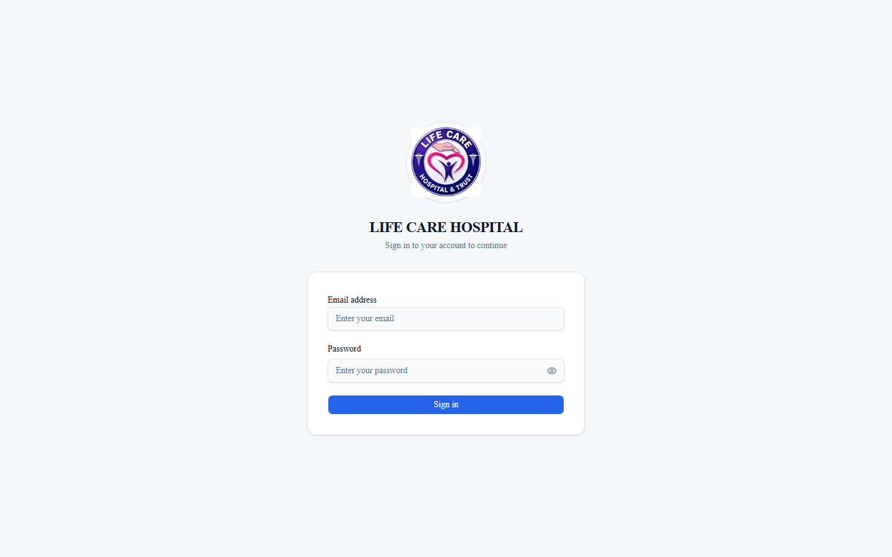
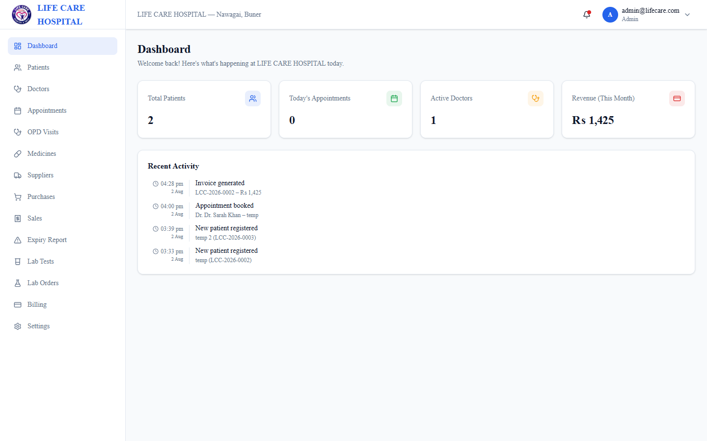
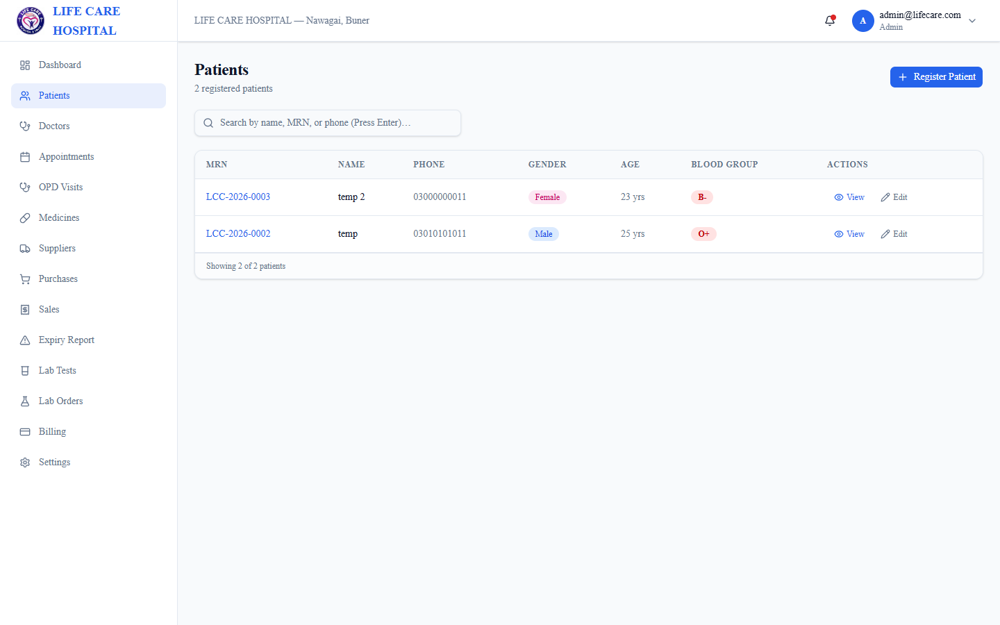
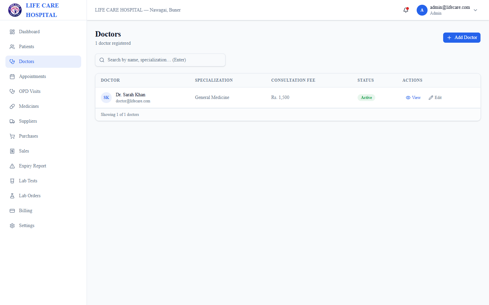
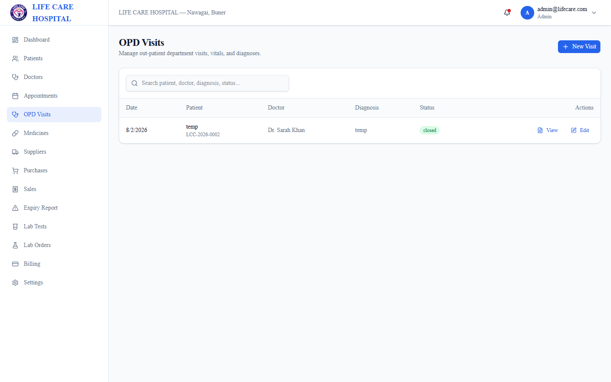
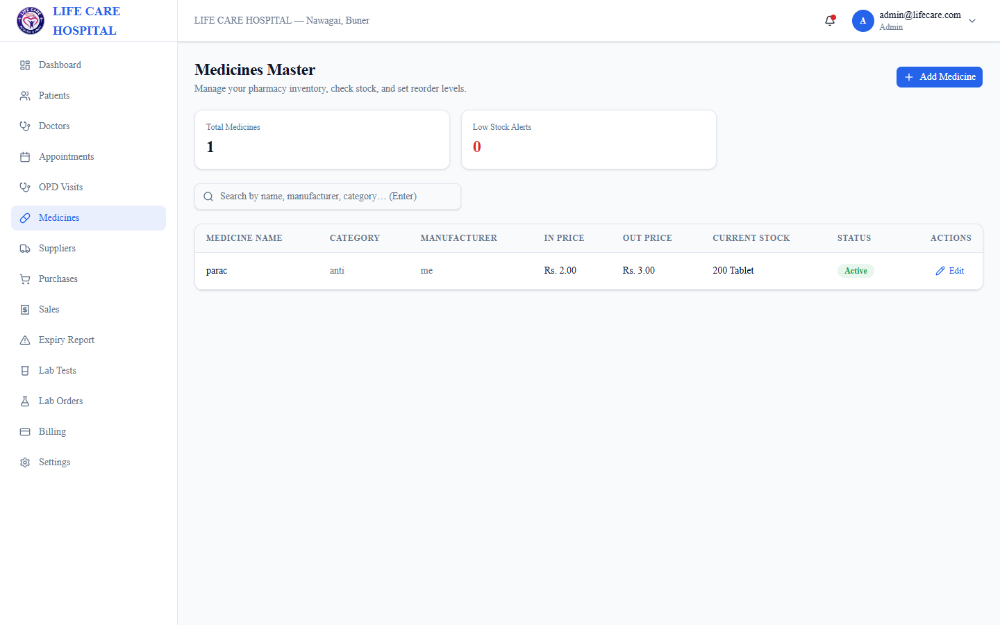
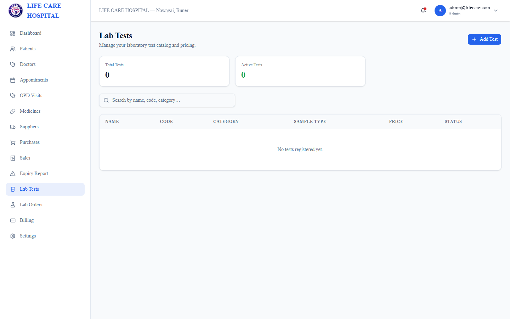

# 🏥 Life Care Clinic - Hospital Management System (HMS)

> A modern, full-featured **Hospital & Clinic Management System** built with **Next.js 16**, **Electron 43**, **Prisma v7 ORM**, **SQLite**, and **TailwindCSS**. Designed to run seamlessly as both a cross-platform **Electron Desktop Application** and a high-performance **Web Application**.

---

## 🌟 Overview

**Life Care Clinic HMS** provides healthcare facilities with an end-to-end clinical workflow system—from patient registration and doctor scheduling to OPD visit management, pharmacy inventory, laboratory test processing, and billing.

### Key Highlights
- 💻 **Desktop Native & Web**: Packaged into an offline-first Windows NSIS installer with an embedded SQLite database.
- 🔐 **Role-Based Access Control (RBAC)**: Fine-grained permissions across Admin, Doctor, Receptionist, Cashier, Pharmacist, and Lab Technician roles.
- ⚡ **Next.js 16 & Turbopack**: Blazing-fast server components, server actions, and dynamic route rendering.
- 📊 **Real-time Analytics**: Dashboard overview of daily visits, revenue metrics, patient flow, and pending lab orders.
- 📦 **Embedded Database Architecture**: Automatic database provisioning and migration handling in `%APPDATA%\hms\hms.db`.

---

## 🖼️ Application Screenshots & Features

### 🔐 1. Authentication & Role-Based Access Control
Secure authentication powered by `iron-session` with session persistence, encrypted passwords (`bcrypt`), and multi-role permission mapping.



---

### 📊 2. Clinical Dashboard & Analytics
Comprehensive dashboard displaying active patient counts, doctor schedules, daily OPD consultations, pharmacy inventory alerts, and financial summaries.



---

### 🩺 3. Patient Management & Electronic Health Records (EHR)
Complete patient registry with Medical Record Numbers (MRN), demographics, contact details, blood group, medical history, and linked OPD visits.



---

### 👨‍⚕️ 4. Doctor Scheduling & Management
Doctor directory with specialization details, qualification records, consultation fees, and recurring weekly schedule slots.



---

### 📋 5. OPD Visits & Clinical Consultations
Out-Patient Department (OPD) queue handling, symptom tracking, vital signs recording, prescriptions, diagnosis notes, and status management.



---

### 💊 6. Pharmacy & Inventory Management
Medicine catalog management, stock movement logs, supplier invoices, reorder level tracking, batch/expiry alerts, and point-of-sale integration.



---

### 🔬 7. Laboratory Information System (LIS)
Lab test directory, category configuration, reference range definitions, lab order generation, sample tracking, and test result reporting.



---

## 🛠️ Tech Stack & Architecture

| Layer | Technology |
| :--- | :--- |
| **Framework** | [Next.js 16](https://nextjs.org/) (App Router, Turbopack, React 19) |
| **Desktop Shell** | [Electron 43](https://www.electronjs.org/) |
| **Database ORM** | [Prisma v7](https://www.prisma.io/) with `@prisma/adapter-better-sqlite3` |
| **Database Engine** | [SQLite](https://sqlite.org/) via `better-sqlite3` |
| **Authentication** | [iron-session](https://github.com/vercel/iron-session) + `bcrypt` |
| **UI Components** | [Base UI](https://base-ui.com/) / [Shadcn UI](https://ui.shadcn.com/) |
| **Styling** | [TailwindCSS v4](https://tailwindcss.com/) + Lucide Icons |
| **Form Validation** | React Hook Form + [Zod](https://zod.dev/) |
| **Installer Packaging**| `electron-builder` (NSIS Target) |

---

## 🚀 Getting Started

### Prerequisites
- **Node.js**: `v20.x` or `v22.x` / `v24.x`
- **npm**: `v10.x` or higher

### Installation

1. **Clone the repository:**
   ```bash
   git clone https://github.com/aiwithhammad2026-arch/life-care-clinic-hms.git
   cd life-care-clinic-hms
   ```

2. **Install dependencies:**
   ```bash
   npm install
   ```

3. **Initialize Database & Seed Data:**
   ```bash
   # Generate Prisma Client
   npx prisma generate

   # Push schema to SQLite database
   npx prisma db push

   # Seed default roles, permissions, and initial accounts
   npx prisma db seed
   ```

---

## 🔑 Default Accounts

After running database seed, you can log in with any of the pre-configured accounts:

| Role | Email | Password |
| :--- | :--- | :--- |
| **Clinic Admin** | `admin@lifecare.com` | `password123` |
| **System Admin** | `admin@lcc.com` | `Admin@123` |
| **Doctor** | `doctor@lifecare.com` | `password123` |
| **Receptionist** | `reception@lifecare.com` | `password123` |
| **Pharmacist** | `pharmacist@lifecare.com` | `password123` |
| **Lab Tech** | `lab@lifecare.com` | `password123` |
| **Cashier** | `cashier@lifecare.com` | `password123` |

---

## 💻 Development Commands

```bash
# Start Next.js web app in dev mode
npm run dev

# Launch Electron desktop application in dev mode
npm run electron:dev

# Build production Next.js app and package Windows installer
npm run electron:build
```

---

## 📦 Electron Installer & Production Build

The production Windows executable is generated using `electron-builder`:

```bash
npm run electron:build
```

- **Installer Path**: `dist/Life Care HMS Setup 1.0.0.exe`
- **Unpacked App Path**: `dist/win-unpacked/`
- **User Data Storage**: `%APPDATA%\hms\hms.db`
- **Application Error Logs**: `%APPDATA%\hms\server-error.log`

---

## 📄 License

This project is proprietary software developed for **Life Care Clinic**. All rights reserved.
