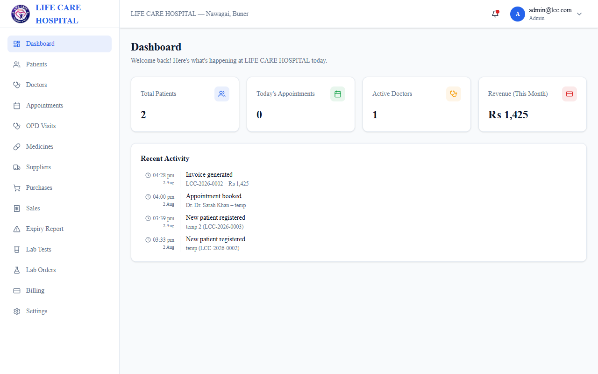
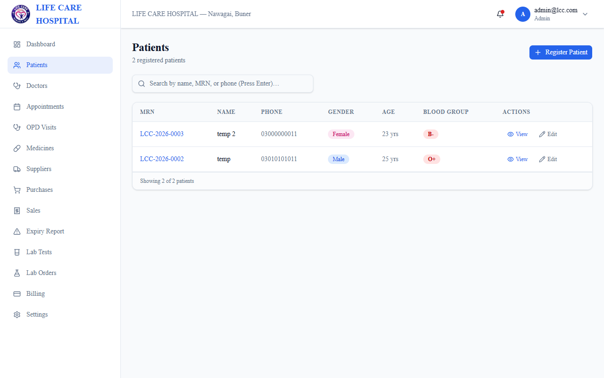
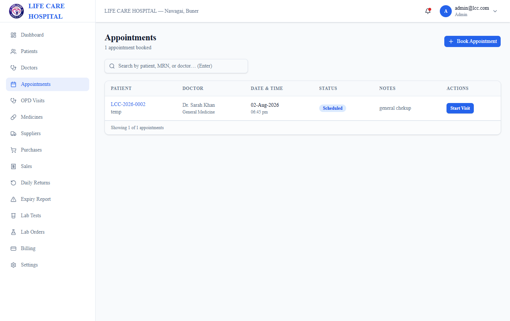
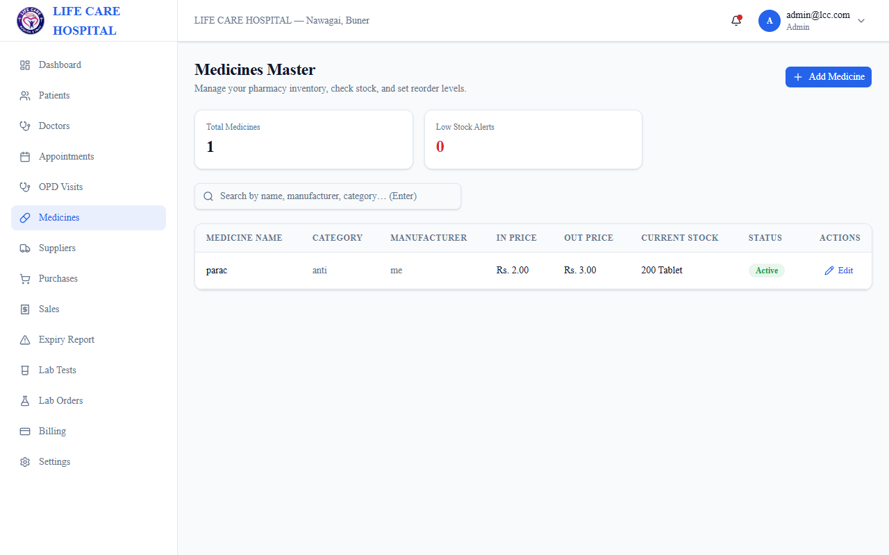
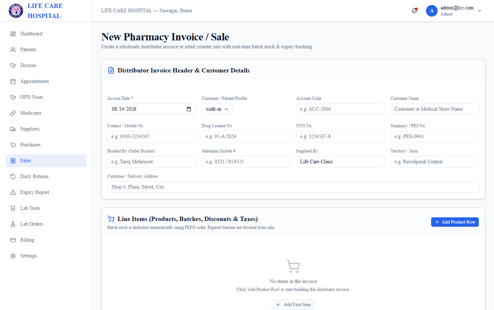
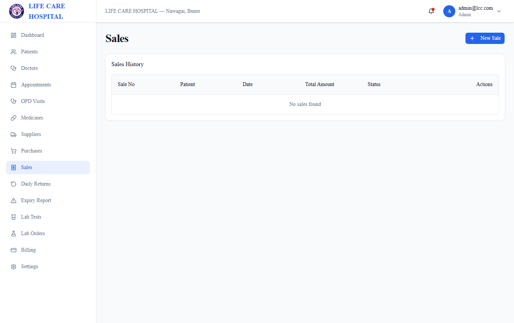
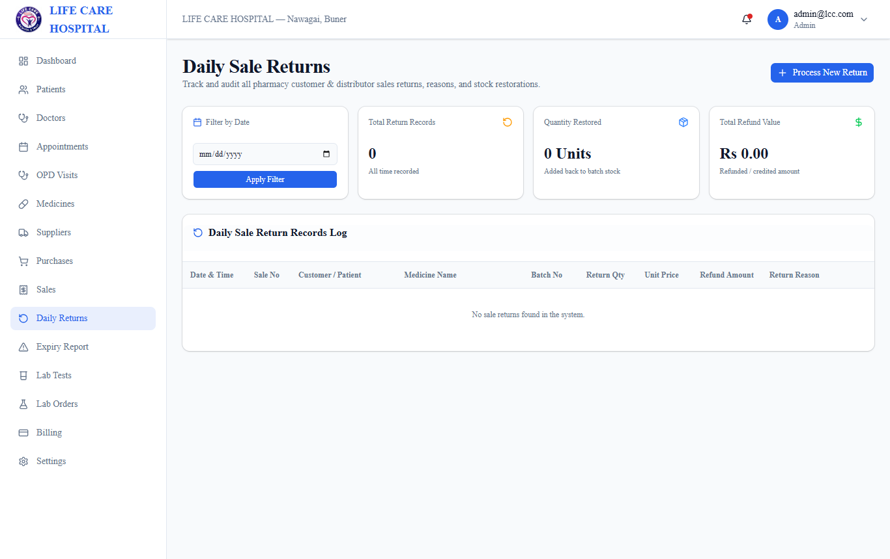
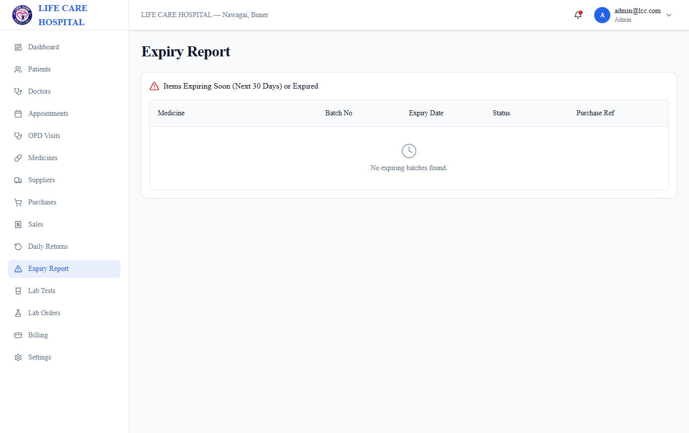
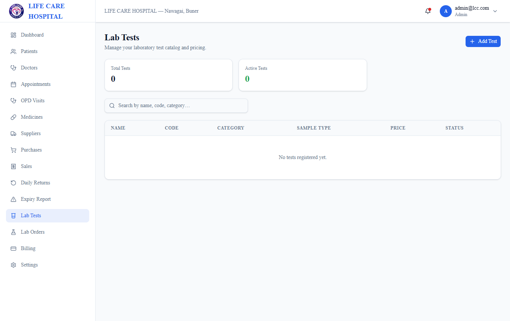
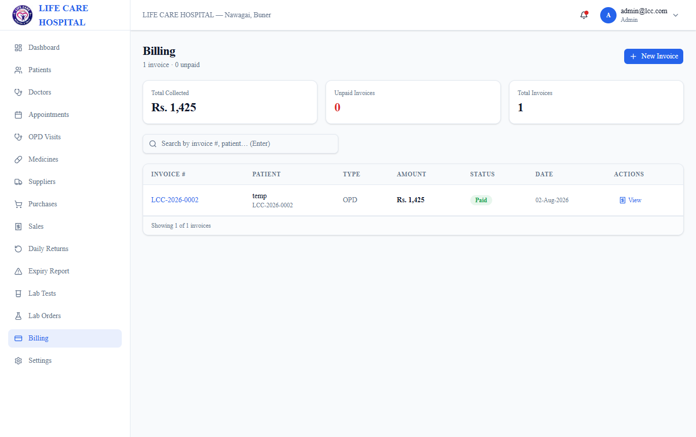

# Hospital Management System (Offline)

A production-grade, offline-first Hospital Management System (HMS) designed and built for private clinics and wholesale pharmacy distributors in Pakistan. Built as a secure, standalone Electron desktop application powered by Next.js 16, React 19, Prisma v7 ORM, and SQLite (`better-sqlite3`), running 100% locally with zero internet or cloud dependencies.

---

## 🛠️ Tech Stack

- **Desktop Shell**: Electron 43 (Windows NSIS Installer & standalone desktop runtime)
- **Framework**: Next.js 16 (App Router, Turbopack, Server Actions, React 19)
- **Database Engine**: SQLite with `better-sqlite3` driver
- **ORM & Data Layer**: Prisma v7 ORM (`@prisma/adapter-better-sqlite3`)
- **PDF Generation**: `@react-pdf/renderer` (Stream-based invoice & lab report generation)
- **Language**: TypeScript 5
- **Styling**: TailwindCSS & Lucide Icons
- **Authentication & Security**: `iron-session` encrypted session cookies + `bcrypt` password hashing + Role-Based Access Control (RBAC)

---

## 🌟 Core Modules & Capabilities

### 1. 🏥 Patient Management & Electronic Health Records (EHR)
- Unique **Medical Record Number (MRN)** generation per patient (`LCC-YYYY-XXXX`).
- Full demographic records, emergency contacts, blood group, phone, and residential address tracking.
- OPD Visit logs with vital signs, clinical symptoms, diagnosis, doctor prescription notes, and appointment history.

### 2. 📅 Doctor Scheduling & Appointments
- Doctor profiles with medical specialization, consultation fee, phone, and duty schedules.
- Multi-slot appointment booking with patient queue status tracking (`scheduled`, `completed`, `cancelled`).

### 3. 💊 Pharmacy Sales & Wholesale Distributor Invoicing
- **Wholesale Distributor Invoice Format**:
  - Full B2B distributor headers: Account Code, Customer / Consignee Address, Drug License No., NTN No., Summary / PRS No., Order Booker / Booked By, Salesman Mobile, Supplied By, and Territory.
  - Multi-batch line-item pricing: Product Code, Batch No, Expiry Date, Billed Qty, Free Qty, Trade Price, Gross Amount, Discount % & Amount, S.Tax, GST, and Net Invoice Amount.
  - Comprehensive invoice footer with item count, total billed & free quantities, gross/discount/tax subtotals, net invoice total, and legal warranty text under Section 23(1)(i) of Drugs Act 1976.
- **FEFO Batch Management & Stock Safety**:
  - Dedicated `Batch` database model tracking `quantityReceived` and `quantityRemaining`.
  - First-Expired, First-Out (FEFO) automated batch allocation for sales.
  - Expiry status visual indicators: `Valid` (Green), `Expiring Soon` (Amber, within 90 days), and `Expired` (Red).
  - Strict server-side validation rejecting any attempt to sell expired medicines or exceed batch stock.
- **Daily Sale Returns**:
  - Dedicated daily return report with date filtering, return breakdown, refund values, and stock restoration to original batches.

### 4. 🧪 Laboratory Information System (LIS)
- Test directory with test code, sample type (Blood, Serum, Urine), price, and category.
- Reference ranges per parameter customized by gender and age group.
- Lab order processing, barcoded sample collection tracking, and test result entry.

### 5. 💳 Billing, Invoices & PDF Printing
- Integrated point-of-sale and clinic billing module.
- Atomically generated invoices linked to OPD consultations, lab tests, and pharmacy sales.
- Professional, high-resolution PDF invoice generation formatted to wholesale distributor standards.

### 6. 🔒 Role-Based Access Control (RBAC)
- Role definitions: `Admin`, `Doctor`, `Receptionist`, `Pharmacist`, `Lab Technician`, and `Cashier`.
- Enforced module-level permissions for Read, Write, Update, Delete, and Discount application.

---

## 🖼️ Application Screenshots

### 01. Secure Login & Role Authentication


### 02. Clinic Overview Dashboard


### 03. Patient Directory & Medical Records


### 04. Doctor Appointments & OPD Queue


### 05. Pharmacy Medicines Inventory & Batch Stock


### 06. Wholesale Distributor Invoice & Sale Form


### 07. Sales History & Invoices Directory


### 08. Daily Sale Returns & Stock Restorations


### 09. Expiry Report & Stock Safety Audit


### 10. Laboratory Tests & Diagnostic Orders


### 11. Clinic Billing & Payment Invoicing


---

## 🚀 Getting Started & Local Setup

### Prerequisites
- **Node.js**: v20.x or higher
- **npm**: v10.x or higher
- **Windows**: (for native `.exe` desktop installer build)

### Installation
```bash
# 1. Install dependencies
npm install

# 2. Sync SQLite database schema
npx prisma db push

# 3. Generate Prisma client
npx prisma generate

# 4. (Optional) Run batch migration & reconciliation
npx tsx scripts/migrate-batches.ts

# 5. Run development server
npm run dev
```

### Building Desktop Electron App
```bash
# Build standalone offline desktop executable (.exe)
npm run electron:build
```

---

> **Note**: This repository contains offline desktop healthcare management software for private medical clinics.
