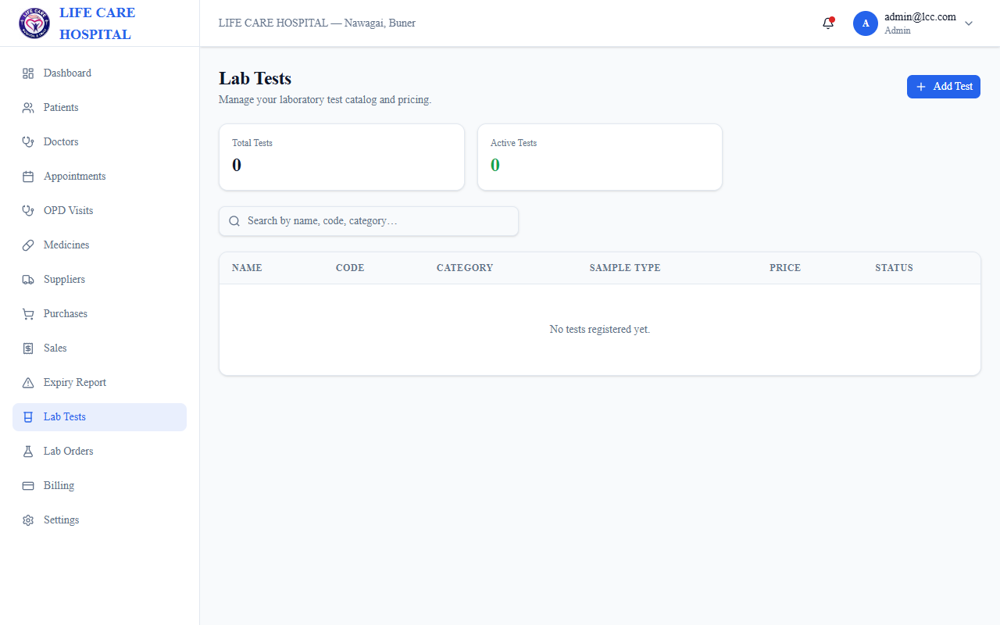
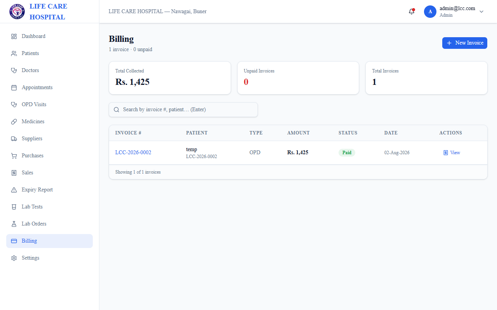

# Hospital Management System (Offline)

A full offline Hospital Management System (HMS) built for a clinic in Pakistan — Electron desktop app with Next.js, Prisma, and SQLite, running fully offline with no internet or server dependency. Includes patient records, appointments, pharmacy (FEFO batch tracking), lab module, billing/invoicing, and role-based access.

---

## 🛠️ Tech Stack

- **Desktop Shell**: Electron 43
- **Framework**: Next.js 16 (App Router, Turbopack, React 19)
- **Database ORM**: Prisma v7 ORM
- **Database Engine**: SQLite (`better-sqlite3`)
- **Language**: TypeScript
- **Styling**: TailwindCSS
- **Authentication**: `iron-session` + `bcrypt`

---

## 🌟 Key Features

- **Offline-First Architecture**: Runs completely local with zero cloud dependencies or external server requirements.
- **Patient Records & EHR**: Complete patient directory with MRN tracking, contact details, medical history, and OPD visit logs.
- **Appointments Management**: Doctor consultation scheduling and patient queue management.
- **Pharmacy & FEFO Batch Tracking**: FEFO (First-Expired, First-Out) inventory batch management, stock logs, reorder alerts, and sales processing.
- **Lab Module (LIS)**: Laboratory test catalog, order processing, reference range tracking, and test result entry.
- **Billing & Invoicing**: Automated invoice calculation, payment collection, and downloadable PDF receipts.
- **Role-Based Access Control (RBAC)**: Enforced permission structures across Admin, Doctor, Receptionist, Cashier, Pharmacist, and Lab Technician roles.

---

## 🖼️ Screenshots

### Login

### Dashboard

### Patients

### Appointments

### Pharmacy

### Lab Module

### Billing

---

> **Note**: This is an archived copy of my contributions to a collaborative project. Original repository: https://github.com/aiwithhammad2026-arch/life-care-clinic-hms
